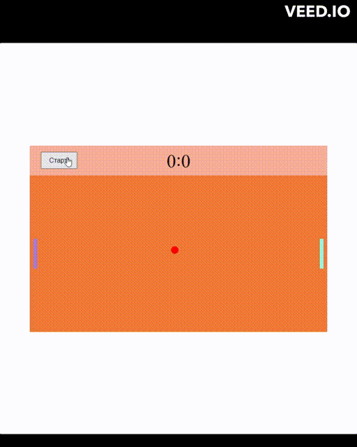

# Ping-pong DOM

## Браузерная игра пинг-понг

Цель данного проекта:

1. Работа с **DOM** графикой и её **анимация**
2. Практика применения **обработчиков событий**
3. **ООП**
4. **ES6** модули
5. Применение метода **requestAnimationFrame()**

### Управление игрой

Левый игрок:

- вверх LeftShift
- вниз LeftControl

Правый игрок:

- вверх ArrowUp
- вниз ArrowDown

[Click to show](https://brainhdv.github.io/ping-pong-dom)
